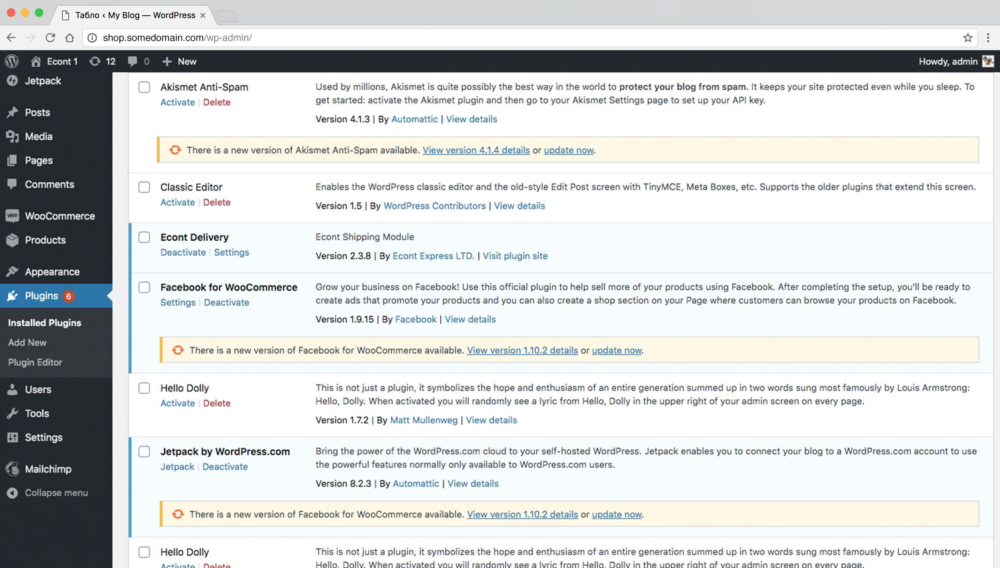
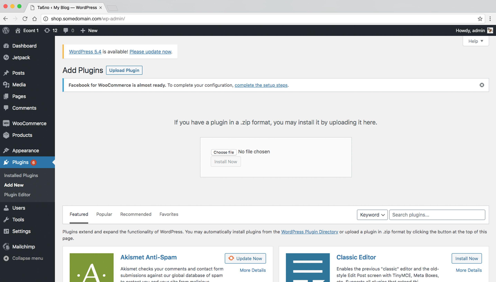
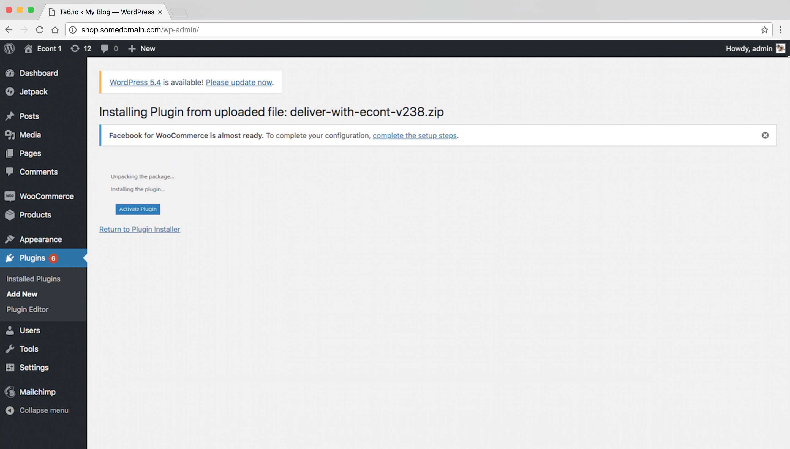

<div align="center">

<div align="center" width="100%">
  
  </div>

# 📦 Econt WooCommerce Плъгин
## Официална Интеграция за Доставки

[](https://github.com/econt/econt-woo-opc-plugin/releases/latest/download/econt-woo-opc-plugin-main.zip)
[](https://wordpress.org)  
[](https://woocommerce.com)
[](https://php.net)

### 🚀 Превърнете вашия WooCommerce магазин в професионална доставна платформа с Econt!

**Автоматизирано управление на пратки • Калкулиране на цени в реално време • Безпроблемна интеграция**

---

### 🎯 За кого е този плъгин?
✅ **Собственици на онлайн магазини** - които искат професионална куриерска услуга  
✅ **Малки и средни бизнеси** - които търсят надеждно решение за логистика  
✅ **WooCommerce магазини** - които имат нужда от автоматизация на доставките  
✅ **Всички с Econt договор** - които искат да интегрират услугите в своя сайт

### 📋 Какво получавате?
🎉 **Готов за употреба за 10 минути** - простa инсталация и настройка  
💰 **Автоматично калкулиране** - на цени за доставка в реално време  
📄 **Генериране на товарителници** - автоматично при всяка поръчка  
🔍 **Проследяване на пратки** - за вас и вашите клиенти  
💳 **Онлайн плащания** - с Econt Pay интеграция

</div>

---

## 📖 Документация

### 🏠 [**Започнете тук - Wiki Начало**](https://github.com/econt/econt-woo-opc-plugin/wiki/)

### 📚 **Ръководства стъпка по стъпка**
| 📄 Ръководство | 🎯 За какво е | ⏱️ Време |
|----------------|---------------|-----------|
| **[📥 Инсталация](https://github.com/econt/econt-woo-opc-plugin/wiki/Installation)** | Как да инсталирате плъгина | 5 мин |
| **[⚙️ Първоначална настройка](https://github.com/econt/econt-woo-opc-plugin/wiki/Initial-Setup)** | API конфигурация и основни настройки | 10 мин |
| **[📦 Настройка на продукти](https://github.com/econt/econt-woo-opc-plugin/wiki/Product-Configuration)** | Как да подготвите продуктите си | 5 мин |
| **[🎨 Скриване на полета](docs/Field-Hiding-Guide.md)** | Персонализиране на checkout полета **(НОВО v3.0.4)** | 10 мин |
| **[🔧 Отстраняване на проблеми](https://github.com/econt/econt-woo-opc-plugin/wiki/Troubleshooting)** | Решения за чести проблеми | При нужда |

---

## 🚀 Основни Функции - Всичко, от което се нуждаете!

<div align="center">


</div>

---

### 💰 **Автоматично Ценообразуване**
🎯 **Какво получавате:** Цените за доставка се калкулират автоматично в реално време  
🔧 **Как работи:** API свързване с Econt за точни цени според тегло и адрес  
✨ **Ползи:** Няма нужда от ръчни изчисления, винаги актуални цени

---

### 📄 **Генериране на Товарителници**
🎯 **Какво получавате:** Всяка потвърдена поръчка автоматично генерира товарителница в Econt  
🔧 **Как работи:** При Click на "Завърши поръчка" → автоматично се създава товарителница  
✨ **Ползи:** Спестяване на време, намаляване на грешки, професионален работен процес

---

### 🛒 **Съвременни Checkout Опции**
🎯 **Какво получавате:** Работи както с класическия, така и с новия блокови checkout на WooCommerce
🔧 **Как работи:** Автоматично разпознаване и адаптиране към checkout формата
✨ **Ползи:** Максимална съвместимост, готов за бъдещето

---

### 🎨 **Селективно Скриване на Полета** **(НОВО в v3.0.4)**
🎯 **Какво получавате:** Пълен контрол върху кои checkout полета да се скрият при избор на Econt доставка
🔧 **Как работи:** Изберете конкретни полета (име, адрес, телефон) вместо скриване на целия блок
✨ **Ползи:**
- По-добро потребителско изживяване - показвайте само нужните полета
- Оставете имейл видим за регистрация
- Персонализирани CSS селектори за всяка тема
- Работи с Classic и Block checkout
- Съвместимо с Elementor, Divi и други page builders

📖 **[Виж пълното ръководство](docs/Field-Hiding-Guide.md)**

---

### 🔍 **Проследяване на Пратки**
🎯 **Какво получавате:** Уникални tracking номера за всяка пратка  
🔧 **Как работи:** Автоматично генериране и предоставяне на tracking данни  
✨ **Ползи:** Доволни клиенти, намалени запитвания, професионален имидж

---

### 🎛️ **Администраторско Управление**
🎯 **Какво получавате:** Специализирани колони и действия в админ панела  
🔧 **Как работи:** Нови опции в WooCommerce поръчки за управление на доставки  
✨ **Ползи:** Лесно управление, бърз достъп до информация, ефективност

---

### ⚡ **Bulk Операции**
🎯 **Какво получавате:** Синхронизиране на множество товарителници наведнъж  
🔧 **Как работи:** Избор на множество поръчки и групова обработка  
✨ **Ползи:** Огромно спестяване на време при обработка на много поръчки

---

### 💳 **Econt Pay Интеграция**
🎯 **Какво получавате:** Онлайн плащания директно чрез Econt Pay система  
🔧 **Как работи:** Интеграция с платежна система на Econt за безпроблемни транзакции  
✨ **Ползи:** Повече възможности за плащане, увеличени продажби, по-доволни клиенти

---

### 🔄 **Автоматични Обновления**
🎯 **Какво получавате:** Винаги най-новата версия без ръчна работа  
🔧 **Как работи:** Автоматично известяване и обновяване от GitHub  
✨ **Ползи:** Винаги актуални функции, сигурност, без загуба на време

---

### 🚄 **HPOS Съвместимост**
🎯 **Какво получавате:** Работа с най-новите оптимизации на WooCommerce  
🔧 **Как работи:** Пълна съвместимост с High-Performance Order Storage  
✨ **Ползи:** По-бърз сайт, по-добра производителност, готов за бъдещето


## 📋 Изисквания - Проверете дали сте готови!

<div align="center">


</div>

---

### 🖥️ **Системни Изисквания**

| 🔧 Компонент | ✅ Минимум | ⭐ Препоръчано | 🔍 Как да проверя |
|--------------|------------|----------------|-------------------|
| **WordPress** | 6.0+ | Последна версия | Dashboard → Обновления |
| **WooCommerce** | 9.0+ | Последна версия | Плъгини → WooCommerce |
| **PHP** | 8.0+ | 8.1+ или по-нова | Site Health → PHP Version |
| **HTTPS/SSL** | ✅ Задължително | Валиден SSL | Адресната лента → 🔒 |

---

### 🏢 **Econt Изисквания**

| 📋 Какво ви трябва | ✅ Статус | 📖 Инструкции |
|-------------------|----------|---------------|
| **Econt профил** | Безплатна регистрация | [👉 Регистрация тук](https://delivery.econt.com/) |
| **API достъп** | Безплатен за клиенти | Получавате след регистрация |
| **Активен договор** | За реални доставки | [👉 Информация тук](https://www.econt.com/solutions/online-stores) |

---

### 📦 **Изисквания за Продукти - Важно!**

| 📋 Изискване | 🎯 Защо е важно | 🔧 Как да направя |
|-------------|----------------|------------------|
| **Тегло в килограми** | Без тегло няма да се калкулират цени | Продукти → Редактирай → Доставка → Тегло |
| **Физически продукти** | Виртуални продукти не се доставят | Автоматично изключване |
| **Вариации с тегло** | За променливи продукти | За всяка вариация отделно |

---

### ✅ **Бърза Проверка - Готови ли сте?**

<details>

**1. WordPress/WooCommerce:**
- [ ] WordPress 6.0 или по-нов
- [ ] WooCommerce 9.0 или по-нов
- [ ] PHP 8.0 или по-нов
- [ ] SSL сертификат (https://)

**2. Econt профил:**
- [ ] Регистриран в [delivery.econt.com](https://delivery.econt.com/)
- [ ] Получени API данни (Store ID + Private Key)
- [ ] Подписан договор за реални доставки

**3. Продукти:**
- [ ] Всички продукти имат зададено тегло
- [ ] Вариациите имат отделно тегло
- [ ] Проверени са настройките за доставка

🎉 **Ако всичко е валидно - готови сте за инсталация!**

</details>

---

## 📖 Документация

### 🏠 [**Wiki Начало**](https://github.com/econt/econt-woo-opc-plugin/wiki/) - Започнете тук!

### 📚 **Ръководства за потребители**
- **[📥 Ръководство за инсталация](https://github.com/econt/econt-woo-opc-plugin/wiki/Installation)** - Пълни инструкции за инсталация
- **[⚙️ Първоначална настройка](https://github.com/econt/econt-woo-opc-plugin/wiki/Initial-Setup)** - API конфигурация и първоначални настройки
- **[📦 Конфигурация на продукти](https://github.com/econt/econt-woo-opc-plugin/wiki/Product-Configuration)** - Настройка на продукти за доставка
- **[🔧 Отстраняване на проблеми](https://github.com/econt/econt-woo-opc-plugin/wiki/Troubleshooting)** - Чести проблеми и решения

---

## ⚡ Бърз Старт - За 10 Минути до Готова Интеграция!

<div align="center">


</div>

---

### 📥 **Стъпка 1: Изтегляне и инсталиране** (2 минути)

<details>
<summary><b>🖱️ Кликнете тук за детайлни инструкции</b></summary>

#### Вариант A - Директно изтегляне (Препоръчително за начинаещи)
1. **Изтеглете плъгина:** ➡️ [**Кликнете тук за изтегляне**](https://github.com/econt/econt-woo-opc-plugin/releases/latest/download/econt-woo-opc-plugin-main.zip)
2. **Влезте в WordPress Admin** → **Плъгини** → **Добави нов**
   
3. **Качване на плъгин** → **Избери файл** → изберете изтегления ZIP файл
   
4. **Инсталирай сега** → **Активирай плъгина**


#### Вариант B - За напреднали потребители (WP-CLI)
```bash
wp plugin install https://github.com/econt/econt-woo-opc-plugin/releases/latest/download/econt-woo-opc-plugin-main.zip --activate
```

</details>

---

### 🔑 **Стъпка 2: Получаване на API данни от Econt** (3 минути)

<details>
<summary><b>🖱️ Кликнете тук за инструкции</b></summary>

1. **Отидете на:** [delivery.econt.com](https://delivery.econt.com/)
2. **Влезте** в профила си или **се регистрирайте** (безплатно)
3. **Намерете API настройките** в профила си
   
4. **Копирайте:**
    - 🆔 **Store ID** (Client ID)
    - 🔐 **Private Key** (Secret Key)

> 💡 **Няма акаунт в Econt?** [Регистрирайте се тук безплатно](https://delivery.econt.com/)

</details>

---

### ⚙️ **Стъпка 3: Конфигуриране в WordPress** (3 минути)

<details>
<summary><b>🖱️ Кликнете тук за настройки</b></summary>

1. **WordPress Admin** → **Настройки** → **Econt Доставка**
   
2. **Въведете данните:**
    - 🆔 **Store ID:** (от стъпка 2)
       - 🔐 **Private Key:** (от стъпка 2)
      - 🌐 **Environment:** Demo (за тестване) или Production (за реална работа)
      - 🎨 **Customer Details Container:** CSS селектор за основния контейнер с полета за доставка (по подразбиране: `#customer_details`)
         - Използвайте това поле само ако вашата тема използва различен селектор за checkout формата
         - Примери: `.woocommerce-checkout`, `#checkout-form`, `.checkout-wrapper`
3. **Запази настройките**
4. **Тествай връзката**

*Конфигуриране на Econt плъгин настройки*

</details>

---

### 🚚 **Стъпка 4: Активиране на доставката** (2 минути)

<details>
<summary><b>🖱️ Кликнете тук за активиране</b></summary>

1. **WooCommerce** → **Настройки** → **Доставка**
   
2. **Зони за доставка** → **Редактирай** зоната за България
   
3. **Добави метод за доставка** → Изберете **Econt**
   
4. **Запази промените**

> ✅ Готово! Сега клиентите ще виждат Econt като опция за доставка

</details>

---

### 📦 **Стъпка 5: Настройка на продукти** (само ако още не е направена)

<details>
<summary><b>🖱️ Кликнете тук за настройка на продукти</b></summary>

1. **Продукти** → **Всички продукти**
2. **За всеки продукт** → **Редактирай**
3. **Доставка** → **Тегло** → въведете тегло в килограми
4. **Обнови продукта**

> 💡 **Важно:** Без тегло плъгинът няма да може да калкулира цената за доставка

</details>

### 📦 **Стъпка 6: Настройка на EcontPay** (не е задължителна)

<details>
<summary><b>🖱️ Кликнете тук за настройка на плащанията</b></summary>

1. **WooCommerce** → **Настройки** → **Плащания**
   
2. Активирайте **EcontPay**
   
3. **Запази промените**

</details>

---

<div align="center">

### 🎉 **Готово! Вашата Econt интеграция е активна!**

**Тествайте с демо поръчка за да се уверите, че всичко работи правилно.**

| 🎯 Какво да проверите | ✅ Резултат |
|---------------------|-------------|
| **Клиентска страна** | Econt се показва като опция за доставка |
| **Цени** | Автоматично се калкулират според тегло и адрес |
| **Администраторска** | Нови колони и опции за управление на поръчки |

[**🆘 Нещо не работи?**](https://github.com/econt/econt-woo-opc-plugin/wiki/Troubleshooting) **|** [**📞 Поддръжка**](mailto:support_integrations@econt.com) **|** [**📖 Документация**](https://github.com/econt/econt-woo-opc-plugin/wiki/)

</div>

---

## 🔄 Обновления и поддръжка

Плъгинът поддържа **автоматични обновления** от този GitHub repository:
- Известия за обновления в WordPress admin
- Процес на обновяване с едно кликване
- Препоръки за backup преди обновления
- Release notes и changelogs

### Ръчен процес на обновяване
1. Изтеглете последната версия
2. Деактивирайте стария плъгин (настройките се запазват)
3. Изтрийте старите файлове на плъгина
4. Инсталирайте новата версия
5. Активирайте отново плъгина

---

## 🤝 Общност и Принос - Заедно правим по-добър плъгин!

<div align="center">


</div>

---

### 🐛 **Намерихте Проблем? Помогнете ни да го поправим!**

<div align="center">

| 🎯 Какво да направите | 📝 Какво да включите |
|----------------------|---------------------|
| **[📝 Докладвайте бъг](../../issues/new?template=bug_report.md)** | Подробно описание, стъпки, системна информация |
| **[💬 Задайте въпрос](../../discussions)** | Опишете проблема, споделете скрийншоти |
| **[📞 Спешна поддръжка](mailto:support_integrations@econt.com)** | За критични проблеми в production |

</div>

---

### 💡 **Имате Идея за Подобрение?**

<div align="center">

🌟 **[Споделете идеята си](../../discussions)** или **[създайте заявка за функция](../../issues/new?template=feature_request.md)**

Всяка идея е ценна! Вашите предложения правят плъгина по-добър за всички.

</div>

---

## 📞 Поддръжка и Контакти - Винаги тук за вас!

<div align="center">


</div>

---

### 🏢 **Официална Поддръжка от Econt**

<div align="center">

| 📞 Канал | 🎯 За какво | ⏱️ Време за отговор |
|----------|-------------|---------------------|
| 📧 **[Email поддръжка](mailto:support_integrations@econt.com)** | Технически проблеми, API въпроси | 1-2 работни дни |
| 🌐 **[Developer Portal](https://econt.com/developers/)** | Документация, API справки | Винаги достъпен |
| 📋 **[Business Portal](https://delivery.econt.com/)** | Профил управление, договори | Винаги достъпен |

</div>

---

### 👥 **Общностна Поддръжка - Бърза и Безплатна**

<div align="center">

| 💬 Платформа | 🎯 Най-добра за |
|-------------|-----------------|-|
| **[🗨️ GitHub Дискусии](../../discussions)** | Въпроси, идеи, споделяне на опит |
| **[🐛 Issues Tracker](../../issues)** | Бъг репорти, заявки за функции |
| **[📖 Wiki Документация](../../wiki)** | Ръководства, tutorials, FAQ |

</div>

---

### 🆘 **Бърза Помощ - Преди да се свържете с нас**

<details>
<summary><b>🖱️ Кликнете тук за бърза самопомощ</b></summary>

**Най-чести проблеми и решения:**

1. **❌ Не се калкулират цени**
    - ✅ Проверете дали продуктите имат тегло
    - ✅ Проверете API настройките

2. **❌ Не се генерират товарителници**
    - ✅ Проверете Store ID и Private Key
    - ✅ Проверете дали Environment е правилен

3. **❌ Плъгинът не се активира**
    - ✅ Проверете PHP версия (минимум 8.0)
    - ✅ Проверете WooCommerce версия (минимум 9.0)

4. **❌ Други проблеми**
    - ✅ [Прочетете FAQ](../../wiki/Troubleshooting)
    - ✅ [Проверете известни проблеми](../../issues)

</details>

---

---

## 📄 Лиценз

<div align="center">

**Този плъгин е изцяло безплатен и с отворен код!**

[](LICENSE)
[](https://opensource.org)

*Лицензиран под GNU General Public License v2.0 - [прочетете пълните условия](LICENSE)*

</div>

---

## 📊 Статистики и Активност

<div align="center">


</div>

---

<div align="center">

# 🚀 Готови да трансформирате доставките си?

### 👆 Не чакайте повече - започнете още днес!

<table>
<tr>
<td align="center">
<b>🎯 За първи път тук?</b><br>
<a href="../../wiki/Home">

</a><br>
<sub>Пълно ръководство стъпка по стъпка</sub>
</td>
<td align="center">
<b>⚡ Искате веднага да започнете?</b><br>
<a href="../../releases/latest/download/econt-woo-opc-plugin-main.zip">

</a><br>
<sub>Директно изтегляне и инсталация</sub>
</td>
<td align="center">
<b>🆘 Имате проблем?</b><br>
<a href="../../issues/new">

</a><br>
<sub>Бърза и безплатна помощ</sub>
</td>
</tr>
</table>

---

### 🌟 Харесва ви плъгинът?

**Дайте ⭐ звезда и помогнете на други да го открият!**

[](https://github.com/econt/econt-woo-opc-plugin/stargazers)
[](https://github.com/econt/econt-woo-opc-plugin/network/members)

---

### 💼 Професионална Поддръжка

**За бизнес клиенти с специални нужди:**  
📧 [support_integrations@econt.com](mailto:support_integrations@econt.com)  
🏢 [econt.com/business](https://www.econt.com/solutions/online-stores)

---

<br>


<br>

**Благодарим ви, че избрахте Econt за вашия WooCommerce магазин!**  
*Заедно правим онлайн търговията в България по-лесна и по-ефективна.* 🇧🇬

---

<sub><i>Последно обновено: 2025 • Направено с ❤️ от Econt Express и общността</i></sub>

</div>
