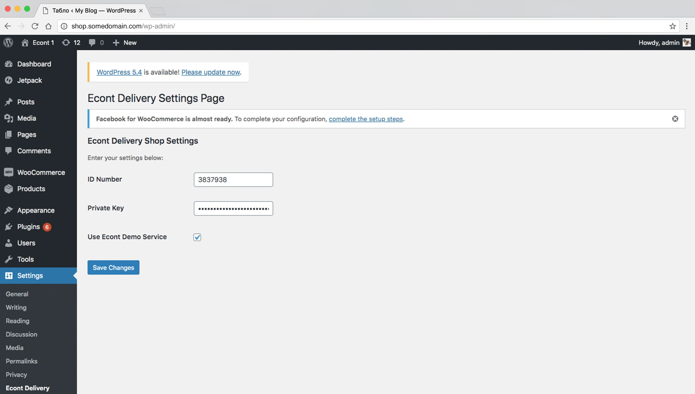
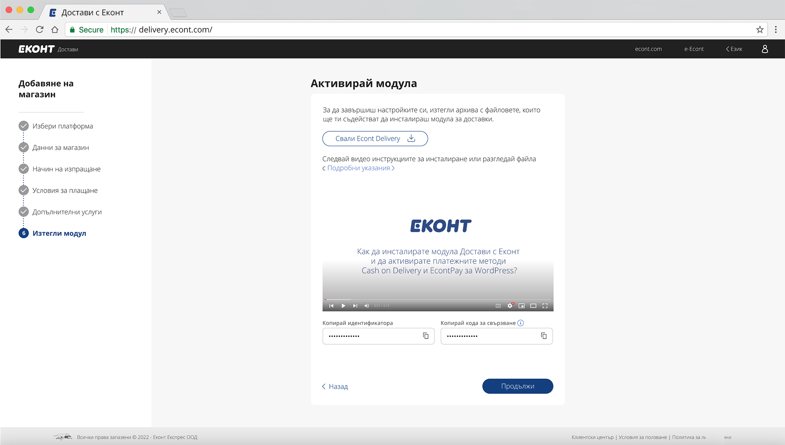
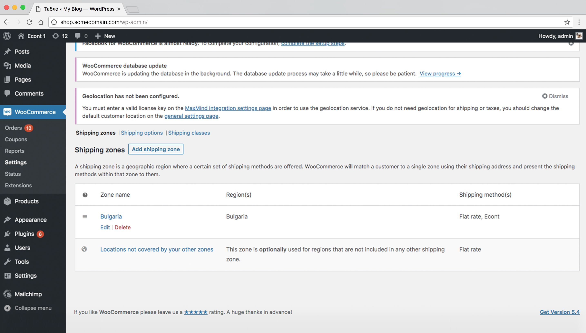
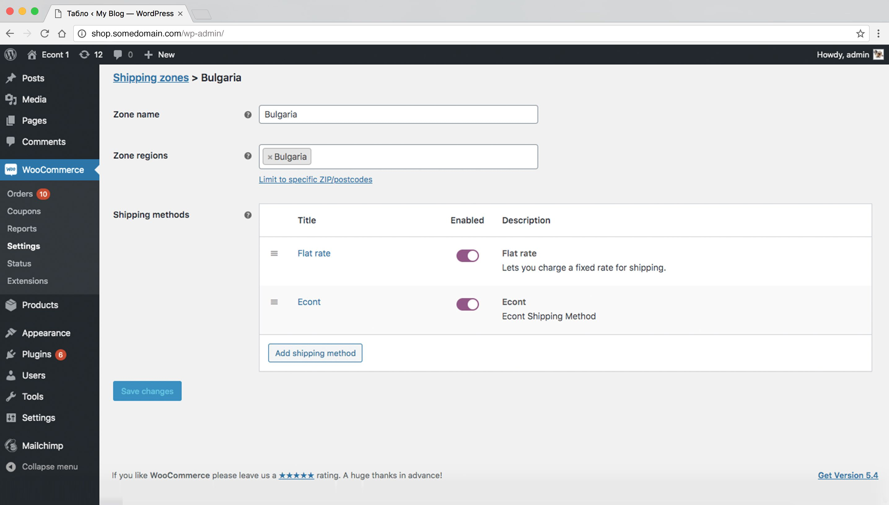
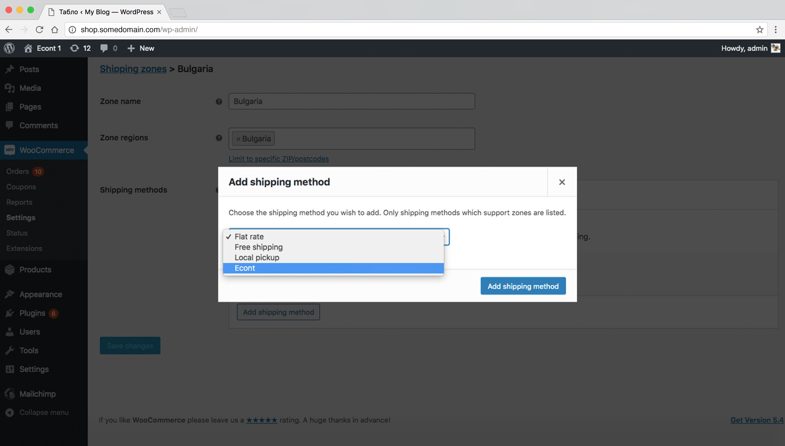
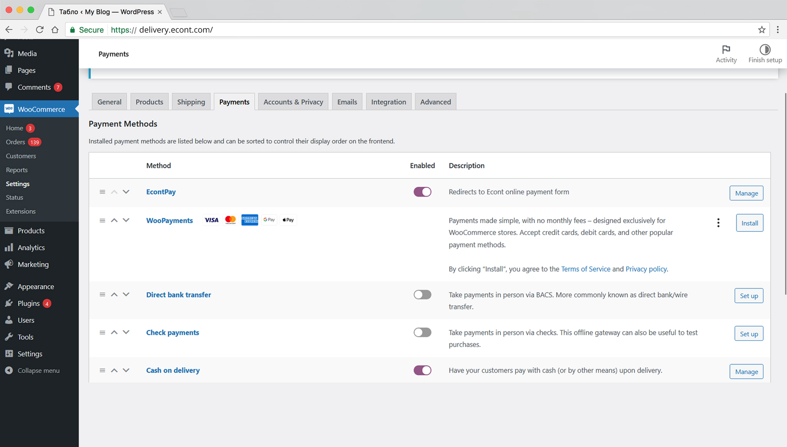
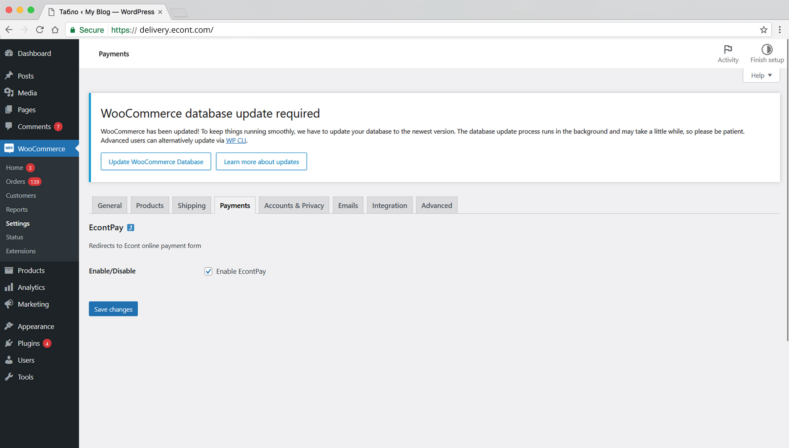

# Първоначална настройка

След успешната инсталация на плъгина, следвайте тези стъпки за конфигуриране на интеграцията с Econt.

## Достъп до настройките

### Метод 1: Чрез Settings менюто
1. Влезте в WordPress Admin панела
2. Отидете на **Настройки → Econt Доставка**

*Достъп до настройките на Econt плъгина*

### Метод 2: Чрез Плъгини страницата
1. Отидете на **Плъгини → Инсталирани плъгини**
2. Намерете "Econt Delivery OneCheckout"
3. Кликнете **Settings** под името

## API настройки

### Environment (Среда)
Изберете средата за работа:

**Production (Продукция):**
- За реални поръчки и клиенти
- Използва live API на Econt
- Таксува реални суми

**Demo (Демо):**
- За тестване и разработка
- Използва sandbox API
- Не таксува реални суми

> 💡 **Съвет:** Винаги започнете с Demo режим за тестване

### Store ID (Идентификатор на магазина)
1. Влезте в [Econt Delivery платформата](https://delivery.econt.com/)
2. Отидете на **Settings → API Integration**

*Получаване на API данни от Econt Delivery платформата*

3. Копирайте вашия **Store ID**
4. Въведете го в полето (само числа)

**Пример:** `12345`

### Private Key (Частен ключ)
1. В Econt Delivery платформата отидете на **API Keys**
2. Генерирайте нов ключ или копирайте съществуващия
3. Въведете целия ключ в полето

**Пример:** `abc123def456ghi789jkl012mno345pqr678stu901vwx234yz`

> ⚠️ **Важно:** Никога не споделяйте частния ключ публично!

## Тест на връзката

### Ръчна проверка

1. Отидете на checkout страница с продукт в количката
2. Изберете Econt като метод за доставка
3. Попълнете адреса за доставка
4. Проверете дали цената се калкулира автоматично

## WooCommerce интеграция

### Активиране на метода за доставка

1. **Отидете на WooCommerce настройки:**
   - **WooCommerce → Настройки → Доставка**

*WooCommerce доставки - настройка на зони*

2. **Конфигурирайте зоните:**
   - Кликнете на зоната (напр. "Bulgaria")
   - В **Shipping Methods** кликнете **Add shipping method**

*Добавяне на Econt като метод за доставка*

   - Изберете **Econt** от dropdown менюто
   - Кликнете **Add shipping method**

*Конфигуриране на Econt доставка*

3. **Настройте приоритета:**
   - Преместете Econt на желаната позиция
   - Кликнете **Save changes**

## Настройки на плащанията

### Наложен платеж (Задължително)
Econt изисква активиран "Cash on Delivery":

1. **Отидете на:**
   - **WooCommerce → Настройки → Payments**

2. **Активирайте "Cash on delivery":**
   - Намерете "Cash on delivery" в списъка
   - Уверете се, че е **Enabled**
   - Кликнете на него за допълнителни настройки

3. **Конфигурирайте:**
   - **Title:** "Наложен платеж"
   - **Description:** "Плащане при доставка"
   - **Instructions:** Инструкции за клиентите
   - **Enable for shipping methods:** Изберете "Econt"

### Econt Pay

1. **Отидете на:**
   - **WooCommerce → Настройки → Payments**

*Настройки на плащанията в WooCommerce*

2. **Активирайте "EcontPay":**
   - Намерете "EcontPay" в списъка
   - Уверете се, че е **Enabled**
   - Кликнете на него за допълнителни настройки

*Конфигуриране на EcontPay платежен метод*

## Конфигуриране на продуктите

### Задължително: Тегло на продуктите
Всички продукти трябва да имат зададено тегло:

1. **За прости продукти:**
   - Редактирайте продукта
   - **Product Data → Shipping**
   - Задайте **Weight** в килограми
   - **Save product**

2. **За променливи продукти:**
   - **Product Data → Variations**
   - За всяка вариация задайте индивидуално тегло
   - **Save changes**

> 📏 **Важно:** Теглото се измерва в килограми (kg)

### Изключване на виртуални продукти
Виртуални продукти автоматично се изключват от Econt доставката:
- eBooks, курсове, софтуер
- Subscriptions, memberships
- Downloadable products

## Първоначален тест

### Тестова поръчка в Demo режим

1. **Подготовка:**
   - Уверете се, че сте в Demo режим
   - Имате продукт с тегло в количката
   - Cash on Delivery / EcontPay е активиран

2. **Процес на тестване:**
   - Отидете на checkout
   - Попълнете валиден адрес в България
   - Изберете "Econt Delivery" като метод
   - Потвърдете поръчката

3. **Очаквани резултати:**
   - Цената за доставка се калкулира автоматично
   - Поръчката се създава успешно
   - В admin панела виждате Econt данни за поръчката

### Проблеми при тестване

**Цената не се калкулира:**
- Проверете дали продуктът има тегло
- Уверете се, че API данните са правилни
- Проверете дали адресът е валиден

**Грешка при поръчката:**
- Активирайте WordPress debug режим
- Проверете error лог файла
- Свържете се с поддръжката ако проблемът продължава

## Премини към Production

Когато сте готови за реални поръчки:

1. **Смени настройките:**
   - Environment: **Production**
   - Въведете production Store ID
   - Въведете production Private Key
   - Премахнете отметката за Демо среда

2. **Финален тест:**
   - Направете тестова поръчка с малка сума
   - Проследете създаването на товарителница
   - Потвърдете, че всичко работи правилно

3. **Мониторинг:**
   - Проследете първите няколко поръчки внимателно
   - Проверете за грешки в логовете
   - Уверете се, че клиентите получават tracking информация

## Следващи стъпки

След завършване на настройката:
- **[Конфигуриране на продукти](Product-Configuration)** - Детайлна настройка на продуктовия каталог

---

## Поддръжка при настройка

При проблеми с настройката:
- 🔧 **Troubleshooting:** [Отстраняване на проблеми](Troubleshooting)
- 🐛 **GitHub Issues:** [Създайте issue](https://github.com/econt/econt-woo-opc-plugin/issues)